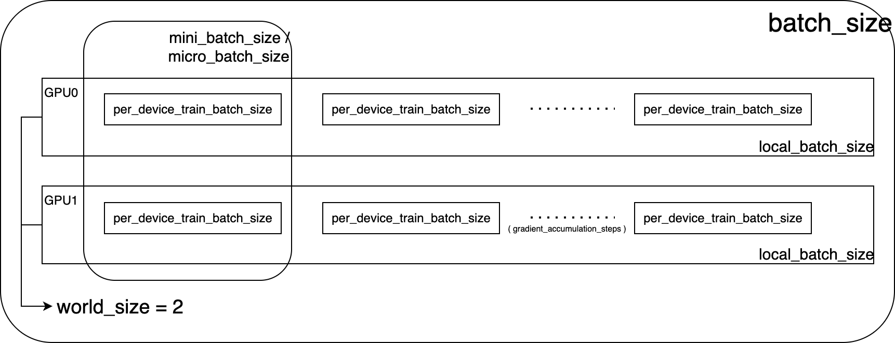

# trl-source-code-interpretation

本仓库旨在系统解读 Hugging Face `trl` 库中 Proximal Policy Optimization (PPO) 算法的核心源码，帮助开发者（本人）深入理解强化学习在大语言模型（LLM）微调中的实现细节。

# Proximal Policy Optimization (PPO) 

## PPO 公式

（近端策略优化）

  

PPO introduces a clipped surrogate objective for policy optimization. By constraining the policy updates within a proximal region of the previous policy using clip, PPO stabilizes training and improves sample efficiency. Specifically, PPO updates the policy by maximizing the following objective:  

$$
\mathcal{J}_{\text{PPO}}(\theta) \;=\; \mathbb{E}_{(q,a) \sim \mathcal{D},\, o_{\leq t} \sim \pi_{\theta_{\text{old}}}(\cdot \mid q)} \!\!\!\!\!\!\!\!\!\!\left[ \min\left( \frac{\pi_\theta(o_t \mid q, o_{<t})}{\pi_{\theta_{\text{old}}}(o_t \mid q, o_{<t})} \hat{A}_t \,,\; \text{clip}\!\left( \frac{\pi_\theta(o_t \mid q, o_{<t})}{\pi_{\theta_{\text{old}}}(o_t \mid q, o_{<t})}, 1-\varepsilon, 1+\varepsilon \right) \hat{A}_t \right) \right], \tag{1}
$$

where $(q,a)$ is a question-answer pair from the data distribution $\mathcal{D}$, $\varepsilon$ is the clipping range of importance sampling ratio, and $\hat{A}_t$ is an estimator of the advantage at time step $t$. Given the value function $V$ and the reward function $R$,  $\hat{A}_t$ is computed using the Generalized Advantage Estimation (GAE):  

$$
\hat{A}_t^{\text{GAE}(\gamma,\lambda)} \;=\; \sum_{l=0}^\infty (\gamma \lambda)^l \delta_{t+l}, \tag{2}
$$

where  

$$
\delta_l \;=\; R_l + \gamma V(s_{l+1}) \;-\; V(s_l), \quad 0 \leq \gamma,\lambda \leq 1. \tag{3}
$$

###  GAE 公式回顾

（Generalized Advantage Estimation ，广义优势估计）
$$
\hat{A}_t^{\text{GAE}(\gamma, \lambda)} = \sum_{l=0}^{\infty}(\gamma\lambda)^l\delta_{t + l}
$$
$$
\delta_{l} = R_{l} + \gamma V(s_{l + 1}) - V(s_{l})
$$


- γ-`gamma`， “折扣因子” ，用于计算优势估计时对未来奖励的衰减

- $δ_l$-`delta`，时刻 l 的 TD（时序差分）误差，反映了价值函数预测的误差

- λ-`lambda`，GAE 的 lambda 参数，控制着优势估计时对不同时间步优势的组合方式，平衡了单步 TD 误差和多步回报的使用

    - **λ=0 的情况**：当 *λ*=0 时，优势估计公式变为：
        $$
        \hat{A}_t^{\text{GAE}(\gamma, 0)} = \delta_{t} = R_{t} + \gamma V(s_{t + 1}) - V(s_{t})
        $$
        这意味着优势估计只考虑当前时间步的 TD 误差，此时优势估计的**方差较大**，因为它没有综合考虑未来的信息，对噪声比较敏感。不过，这种情况下计算简单，在一些简单任务中可能也能取得不错的效果。

    - **λ=1 的情况**：当 *λ*=1 时，优势估计公式变为：
        $$
        \hat{A}_t^{\text{GAE}(\gamma, 1)} = \sum_{l=0}^{\infty}(\gamma)^l\delta_{t + l}
        $$
        此时，优势估计会综合考虑从当前时间步开始的所有未来时间步的 TD 误差，相当于对未来的奖励进行了一个无限长的折扣累积。这种方式可以使优势估计更加稳定，减少方差，但由于考虑了过多的未来信息，可能会**引入更多的偏差**，尤其是在环境动态变化较大的情况下。

    - **0<λ<1 的情况**：在实际应用中，*λ* 通常取一个介于 0 和 1 之间的值，如常见的 *λ*=0.95 。这样既能在一定程度上综合考虑未来的信息，减少优势估计的方差，又不会引入过多的偏差。它通过对不同时间步的 TD 误差赋予不同的权重，使得距离当前时间步越远的 TD 误差，对优势估计的贡献越小。

### 从 logits 到 $\pi_\theta(a \mid s)$ 

**1. 模型输出**

$z = f_\theta(s) \in \mathbb{R}^V$ 

- $z$：模型输出的 logits 向量  
- $V$：词表大小  
- $\theta$：模型参数

**2. softmax 转换为策略分布**

$\pi_\theta(a \mid s) = \frac{e^{z_a}}{\sum_{i=1}^V e^{z_i}} = \text{Softmax}(z)_a$ 

- $z_a$：logits 中对应 action $a$ 的分数  
- 分母是所有 logits 的指数和  
- 得到的是 action $a$ 的概率

**3. 对数概率形式（log-softmax）**

$\log \pi_\theta(a \mid s) = z_a - \log \left( \sum_{i=1}^V e^{z_i} \right)$ 

### PPO 是否使用了 KL 散度？

- [原始PPO论文](https://arxiv.org/abs/1707.06347)：没有直接加KL散度项，只用clip约束。

- trl 库的 PPO 实现使用了  [`kl_estimator`](#KL) （KL 散度估计器）

## conda 环境依赖

`requirements.txt` : 

```
accelerate>=1.4.0
datasets>=3.0.0
transformers>=4.53.2
```

⚠️ 运行 ppo 需修改 accelerate 和 deepspeed 版本

```
accelerate = 0.34.2 
deepspeed = 0.15.4 
```

## `ppo.py` 训练脚本

**脚本路径**：`examples/scripts/ppo/ppo.py` 

### 包和库的关系图

```
标准库
├── shutil (文件操作)
└── torch (深度学习框架)

Hugging Face生态系统
├── accelerate (分布式训练)
├── datasets (数据集管理)
└── transformers (预训练模型)
    ├── AutoModelForCausalLM (策略模型)
    ├── AutoModelForSequenceClassification (奖励/价值模型)
    ├── AutoTokenizer (分词器)
    └── HfArgumentParser (参数解析)

TRL库 (强化学习)
├── 配置类
│   ├── ModelConfig
│   ├── PPOConfig
│   └── ScriptArguments
├── 训练器
│   └── PPOTrainer
└── 工具函数
    ├── get_kbit_device_map
    ├── get_peft_config
    ├── get_quantization_config
    └── SIMPLE_CHAT_TEMPLATE
```

### 关键模型

#### 模型类型

```python
# 价值函数模型
value_model = AutoModelForSequenceClassification.from_pretrained(...)  
# 奖励模型
reward_model = AutoModelForSequenceClassification.from_pretrained(...) 

# 策略模型（要训练的模型）
policy = AutoModelForCausalLM.from_pretrained(...)                    
```

| **对比项**     | **AutoModelForCausalLM**                                     | **AutoModelForSequenceClassification**                       |
| -------------- | ------------------------------------------------------------ | ------------------------------------------------------------ |
| **任务类型**   | **生成任务**：基于前文预测下一个 token，适合文本生成、对话、摘要等任务。 | **分类任务**：对整个文本序列进行分类（如情感分析、文本多标签分类）。 |
| **核心架构**   | Decoder-only（如 GPT、Llama） <br />通常基于自回归 Transformer（如 GPT、Llama）。 <br />使用 Decoder 结构，单向注意力（仅关注左侧上下文）。 | Encoder（如 BERT、RoBERTa）<br />在 Transformer 编码器后添加分类头（通常是全连接层）。 <br />使用双向注意力（如 BERT），捕获全局文本信息。 |

#### 四个关键模型的关系

[策略模型、参考模型、奖励模型、价值模型](#models' relationship)

## `ppo_trainer.py` 模块

**模块路径**：`trl/trainer/ppo_trainer.py`

### `PolicyAndValueWrapper` 类

```python
# taken from https://github.com/OpenLMLab/MOSS-RLHF/blob/40b91eb2f2b71b16919addede0341d2bef70825d/ppo/ppo_trainer.py#L29
# we did this we can do a single `model = accelerator.prepare(model)`
class PolicyAndValueWrapper(nn.Module):
    def __init__(self, policy, value_model) -> None:
        super().__init__()
        self.policy = policy
        self.value_model = value_model
        self.critic_backbone = getattr(value_model, value_model.base_model_prefix)

    def forward(self, **kwargs):
        output = self.critic_backbone(**kwargs)
        logits = self.value_model.score(output.hidden_states[-1])
        return self.policy(**kwargs), logits
```

这段代码定义了一个 `PolicyAndValueWrapper` 类，其作用是**将策略模型和价值模型封装成一个统一的 `nn.Module`模块**。目的是**让 accelerator 可以用一次 `prepare()` 调用就处理好所有模型**，而不需要分别处理策略模型和价值模型。

**为什么使用 `critic_backbone` 而不直接用 `value_model`？**

`critic_backbone`是`value_model`的主干网络。

- 避免重复计算完整的前向传播.

- 只提取特征表示部分，便于后续自定义如何使用这些特征，提升灵活性。

**为什么只封装 `policy` 和 `value_model`，而不包括 `reward_model `和 `reference_model`？**

```python
# 采样阶段（一次性计算）
with torch.no_grad():
    # reward_model: 计算奖励分数
    score = reward_model(query_response)
    
    # reference_model: 计算参考logprobs（用于KL散度）
    ref_logprobs = reference_model(query_response)

# 优化阶段（多轮迭代）
for epoch in range(num_ppo_epochs):
    for mini_batch in mini_batches:
        # policy + value_model: 需要同时计算并更新
        policy_output, value_output = model(mini_batch)  # 封装后的模型
        loss = policy_loss + value_loss
        loss.backward()  # 只有这两个模型需要梯度更新
```

### `PPOTrainer` 类

- `__init__`：完成所有训练前的准备工作，包括模型配置、分布式设置、数据加载器等

- `train`：实现PPO算法的核心逻辑，包括采样、奖励计算、优势估计、多轮优化等

- `generate_completions`：生成样本用于监控和调试

### `PPOTrainer.__init__` 方法

#### 主要流程

1. 参数配置与验证
    - 验证 policy $\neq$ reference
    - 配置 stop_token, kl_estimator, is_peft_available, ref_model, other

2. 批量大小计算
3. 模型封装和优化器设置
4. PPO训练器特定设置
5. 数据加载器准备

#### 关键代码 `processing_class` 类型

`processing_class` 类型：统一接口设计，可进行多模态

```python
processing_class: Optional[
    Union[PreTrainedTokenizerBase, BaseImageProcessor, FeatureExtractionMixin, ProcessorMixin]
],
```

#### 关键代码 验证 policy $\neq$ reference

**防止策略模型（policy model）和参考模型（reference model）指向同一个对象**

```python
if ref_model is model:
    raise ValueError(
        "`model` and `ref_model` cannot be the same object. If you want `ref_model` to be the same as `model`, you must make a copy of it, or `None` if you use peft."
    )
```

如果策略模型（policy model）和参考模型（reference model）指向同一个对象

- clip 机制失效

```python
# 因为是同一个模型
π_θ(a|s) = π_old(a|s)  # 完全相同
r(θ) = π_θ(a|s) / π_old(a|s) = 1  # 比率恒为1

# PPO的clip损失
L_CLIP = E[min(r(θ)A, clip(r(θ), 1-ε, 1+ε)A)]

# 当 r(θ) = 1 时
L_CLIP = E[min(A, A)] = E[A]  # 退化为普通策略梯度
```

- KL 散度为0

```python
# KL散度计算
KL = E[log(π_θ(a|s)) - log(π_old(a|s))]
   = E[log(π_θ(a|s) / π_old(a|s))]
   = E[log(1)] = 0  # 恒为0
```

#### 关键代码 `data_collator` 组件

`data_collator`（数据整理器组件）：

- 批次组装：将多个单独的样本组合成一个训练批次

- 数据对齐：处理不同长度的序列，使它们在同一批次中具有相同的形状

- 格式转换：将数据转换为模型可以接受的张量格式

```python
# Define the collator if not provided
if data_collator is None:
    data_collator = DataCollatorWithPadding(self.processing_class)
```

#### 关键代码 `stop_token` 配置

`stop_token` 配置：配置文本生成的停止条件，支持使用EOS token或自定义token ID

```python
# Handle stop token settings: update policy model's generation_config to use provided stop token
if args.stop_token and args.stop_token_id:
    raise ValueError("You cannot set both `stop_token` and `stop_token_id`.")
elif args.stop_token:
    if args.stop_token == "eos":
        self.policy_model.generation_config.eos_token_id = self.stop_token_id = processing_class.eos_token_id
    else:
        raise ValueError(
            f"Unknown `stop_token` {args.stop_token}. Allowed values are: `'eos'` and `None` (no stop token)."
        )
else:
    self.policy_model.generation_config.eos_token_id = self.stop_token_id = args.stop_token_id  # None or int
```

#### 关键代码 `kl_estimator` 组件<a id="KL"></a>

`kl_estimator` （KL 散度估计器）

 [参考 blog：Approximating KL Divergence](http://joschu.net/blog/kl-approx.html) 

```python
# Check that the kl estimator is valid
if self.args.kl_estimator not in {"k1", "k3"}:
    raise ValueError(
        "kl_estimator must be either 'k1' (straightforward, unbiased) or 'k3' (lower variance, unbiased, "
        "appears to be a strictly better estimator). See "
        "[Approximating KL Divergence](http://joschu.net/blog/kl-approx.html) for details."
    )
```

#### 关键代码 检查是否为 `PeftModel `

检查是否为 `PeftModel`

```python
# if model is a peft model and we have a peft_confg, we merge and unload it first
if isinstance(self.policy_model, PeftModel):
    self.policy_model = self.policy_model.merge_and_unload()
```

- 逻辑：若当前 `policy_model` 已是 PEFT 模型（如已加载 LoRA 权重），则：

    - `merge_and_unload()` 将适配器权重合并到基础模型中，并释放适配器内存。

- **目的**：清除旧的 PEFT 配置，避免与新配置冲突（如不同 LoRA 秩）。

- ```python
    # 合并前
    self.policy_model = PeftModel(
        base_model=PreTrainedModel(...),
        peft_config=LoRAConfig(...),
    )
    
    # 合并后
    self.policy_model = PreTrainedModel(...)  # 适配器已移除，权重已合并
    ```

#### 关键代码 设置 `ref_model` 

设置 `ref_model` 参考模型

```python
if ref_model:
    self.ref_model = ref_model
elif self.is_peft_model:
    self.ref_model = None  # PEFT模型可以通过adapter切换实现参考模型
else:
    self.ref_model = create_reference_model(self.policy_model)  # 创建策略模型的副本
```

根据情况设置参考模型：

- 如果提供了参考模型，直接使用
- 如果是PEFT模型，通过adapter切换实现
    - 为什么  `ref_model`  可以为 `None` ，而 `policy_model`  需要将适配器权重合并到基础模型中并释放适配器内存？
        -  `ref_model`  只用于推理，不需要训练； `policy_model` 需要训练，接收梯度更新

- 否则创建策略模型的副本作为参考模型

#### 关键代码 calculate various batch sizes

calculate various batch sizes，批次大小计算

**各类 batch size 的关系**

 

- `per_rank_rollout_batch_size` is our `args.local_batch_size`

- `per_rank_minibatch_size` is our `args.local_mini_batch_size`

- |      | **mini-batch**           | **micro-batching**                         |
    | ---- | ------------------------ | ------------------------------------------ |
    | 定义 | 模型训练中使用的数据批次 | 将 mini-batch 进一步划分用于流水线并行处理 |

 **`whiten_rewards` 奖励白化** 

核心作用是标准化奖励分布，通过将奖励转换为均值为 0、标准差为 1 的分布（即 $r_{\text{whitened}} = \frac{r - \mu_r}{\sigma_r}$）

```python
if args.whiten_rewards:
    assert args.local_mini_batch_size >= 8, ( 
    # 批次大小过小会导致，均值和标准差估计不准确（统计量受随机波动影响大）
        f"Per-rank minibatch size {args.local_mini_batch_size} is insufficient for whitening"
    )
```

**其他代码**

```python
# 时间戳同步机制
time_tensor = torch.tensor(int(time.time()), device=accelerator.device)
time_int = broadcast(time_tensor, 0).item()  # avoid different timestamps across processes

# 不同进程的本地种子设置
self.local_seed = args.seed + accelerator.process_index * 100003  # Prime，确保不同进程的种子有足够的差异性，避免随机数重复

# 采样生成频率计算
if args.num_sample_generations > 0:
    self.sample_generations_freq = max(1, args.num_total_batches // args.num_sample_generations)
    
# 本地数据加载器批次大小 
self.local_dataloader_batch_size = args.local_batch_size
```

- Rollout（推出/展开）指模型与环境交互，生成一系列的状态-动作-奖励序列，是生产训练数据的过程
- Sample generations是监控和评估工具，用于观察模型训练进度

#### 关键代码 setup model, optimizer, and others

setup model, optimizer, and others，模型封装和优化器设置

```python
#########
# setup model, optimizer, and others
#########
for module in [self.policy_model, self.ref_model, self.value_model, self.reward_model]:
    if module is not None:
        disable_dropout_in_model(module)
        
self.model = PolicyAndValueWrapper(self.policy_model, self.value_model)
self.model.config = self.policy_model.config  # needed for pushing to hub

self.create_optimizer_and_scheduler(
    num_training_steps=args.num_total_batches
)  # note that we are calling `self.lr_scheduler.step()` manually only at the batch level
```

**作用**：

- 禁用PPO训练中所有模型的Dropout层，确保模型在训练和推理时的行为一致性
    - PPO需要计算策略比率：$ \frac{\pi_\theta(a \mid s)}{\pi_{\text{old}}(a \mid s)} $，如果有Dropout，这个比率会因为随机性而不准确
- 用 `PolicyAndValueWrapper` 封装策略模型和价值模型
- 创建优化器和学习率调度器
    - 在PPO训练中，学习率调度器的步进（step）是手动调用的，并且只在批次级别（batch level）进行调用。
        - 确保学习率调度与PPO的update周期一致，每个update对应一个学习率调度步骤
        - 避免在PPO的多轮优化中过度降低学习率，保持训练的稳定性
        - 在强化学习中，一个"训练步"通常指完成一个完整的策略更新，而不是每个梯度更新


#### 关键代码 trainer specifics

trainer specifics，PPO训练器特定设置

```python
self.callbacks # 回调配置
callback_handler # 回调处理器
# 在深度学习训练中，callback用于在训练过程的不同阶段执行特定操作（如 训练控制、日志记录、模型保存、学习率调度 等）。

# 训练控制器
self.control = TrainerControl() 
# 控制训练流程（是否继续训练、是否保存、是否评估等）
# 提供训练过程中的决策机制

# 训练器的状态管理
self.state = OnlineTrainerState(
    # 进程角色识别
  	is_local_process_zero=self.is_local_process_zero(), # 是否是本地主进程（每个节点的第一个进程）
		is_world_process_zero=self.is_world_process_zero(), # 是否是全局主进程（整个训练的第一个进程）
    stateful_callbacks=[
        cb for cb in self.callback_handler.callbacks + [self.control] if isinstance(cb, ExportableState)
    ], # 收集需要保存状态的回调函数，用于训练中断后的恢复
)

self.current_flos = 0 # 当前的浮点运算次数（FLOPs），用于性能统计
self.hp_search_backend = None # 超参数搜索后端（如Optuna、Ray Tune等）

# 检测分布式训练框架
self.is_deepspeed_enabled
self.is_fsdp_enabled
```

#### 关键代码 setup dataloader

setup dataloader，数据加载器设置

```python
shuffle=True, # 每个epoch开始时随机打乱数据顺序

collate_fn=self.data_collator, # 将不同长度的序列padding到相同长度，生成attention_mask等
# eg：
# 输入：不同长度的样本
samples = [
    {"input_ids": [1, 2, 3]},
    {"input_ids": [4, 5, 6, 7, 8]}
]
# data_collator 处理后
batch = {
    "input_ids": [[1, 2, 3, 0, 0],      # padding到最大长度
                  [4, 5, 6, 7, 8]],
    "attention_mask": [[1, 1, 1, 0, 0], # 标记有效位置
                       [1, 1, 1, 1, 1]]
}

# 丢弃最后一个不完整的批次
drop_last=True,  # needed; otherwise the last batch will be of ragged shape
# todo 数据宝贵 不能随便丢

# 全局种子设置
torch.manual_seed(args.seed)
# 目的：确保所有GPU的DataLoader有相同的shuffle顺序
# 问题场景：
# GPU 0: torch.manual_seed(42) → shuffle顺序 [3,1,4,2,5]
# GPU 1: torch.manual_seed(43) → shuffle顺序 [1,4,2,5,3]  # 不同！
# 解决方案：
# 所有GPU: torch.manual_seed(42) → 相同的shuffle顺序
# 然后通过DistributedSampler确保每个GPU看到不同的数据子集
```

### `PPOTrainer.train` 方法

#### 主要流程

1. 训练初始化
2. 主循环

    1. Rollout 数据收集
        1. 获取查询数据
        2. `model.policy` 生成响应，得到 query_response 对
        3. 计算每对 query_response 的 $log(π_θ)$、$log(π_{\text{old}})$、value、score - 奖励模型得分
        4. 计算 rewards - 最终训练奖励：KL + scores
        5. 计算 advantages（结合values）
    2. PPO 训练循环
        - 第1层：ppo_epoch 多轮训练；
        - 第2层：mini_batch 训练；
        - 第3层：micro_batch 梯度累积 —— 使用rollout数据训练策略模型和价值模型
    3. 日志记录、回调处理、内存清理
3. 训练结束处理：优雅结束和最终保存

#### PPO 中四类模型的公式与关系详解（结合训练代码）<a id="models' relationship"></a>

##### 四个核心模型概览

| 模型     | 变量名         | 功能描述                           | 数学符号           |
| -------- | -------------- | ---------------------------------- | ------------------ |
| 策略模型 | `model.policy` | 当前策略，生成动作或回复           | $\pi_\theta$       |
| 参考模型 | `ref_model`    | 固定旧策略，估算 KL 散度用于正则化 | $\pi_{\text{old}}$ |
| 奖励模型 | `reward_model` | 为响应打分的模型，体现人类偏好     | $r(s, a)$          |
| 价值模型 | `value_model`  | 估算状态或状态-动作对的未来回报    | $V(s)$             |

##### 策略模型与参考模型

###### 策略比值：

$$
r_t(\theta) = \frac{\pi_\theta(a_t | s_t)}{\pi_{\text{old}}(a_t | s_t)}
$$

###### 近似 KL 散度：

- $k_1$ 估计：
$$
\text{KL} \approx -\log r_t(\theta)
$$

- $k_3$ 估计：
$$
\text{KL} \approx (r_t(\theta) - 1) - \log r_t(\theta)
$$

###### 策略损失函数（Clip PPO）：

$$
L^{\text{CLIP}}(\theta) = \mathbb{E}_t \left[ \min \left( r_t(\theta) \hat{A}_t,\; \text{clip}(r_t(\theta), 1 - \epsilon, 1 + \epsilon) \hat{A}_t \right) \right]
$$

##### 奖励模型与 KL 惩罚项

###### 最终奖励公式：

$$
R_t = r_t^{\text{score}} - \beta \cdot \text{KL}(\pi_\theta \| \pi_{\text{old}})
$$

- $r_t^{\text{score}}$：由 `reward_model` 打分；
- $\beta$：KL 正则项系数（`args.kl_coef`）；

##### 价值模型与优势函数

###### TD 残差：

$$
\delta_t = r_t + \gamma V(s_{t+1}) - V(s_t)
$$

###### 广义优势估计（GAE）：

$$
\hat{A}_t = \delta_t + \gamma \lambda \hat{A}_{t+1}
$$

###### 回报：

$$
R_t = \hat{A}_t + V(s_t)
$$

##### 价值函数损失（Value Loss）

$$
L^{\text{value}} = \frac{1}{2} \cdot \max\left( (V - R)^2,\; (\text{clip}(V) - R)^2 \right)
$$

##### PPO 总损失函数

$$
L^{\text{PPO}} = L^{\text{CLIP}}(\theta) + c_v \cdot L^{\text{value}} - \beta \cdot \text{KL}
$$

其中：
- $c_v$：价值函数损失权重；
- $\beta$：KL 散度惩罚项系数；

##### 总体训练过程关系图

  

#### 关键代码

见代码注释

## 参考资料

- [trl 官方文档](https://huggingface.co/docs/trl/index)
- [PPO 原始论文](https://arxiv.org/abs/1707.06347)
- [blog: Approximating KL Divergence](http://joschu.net/blog/kl-approx.html) 

